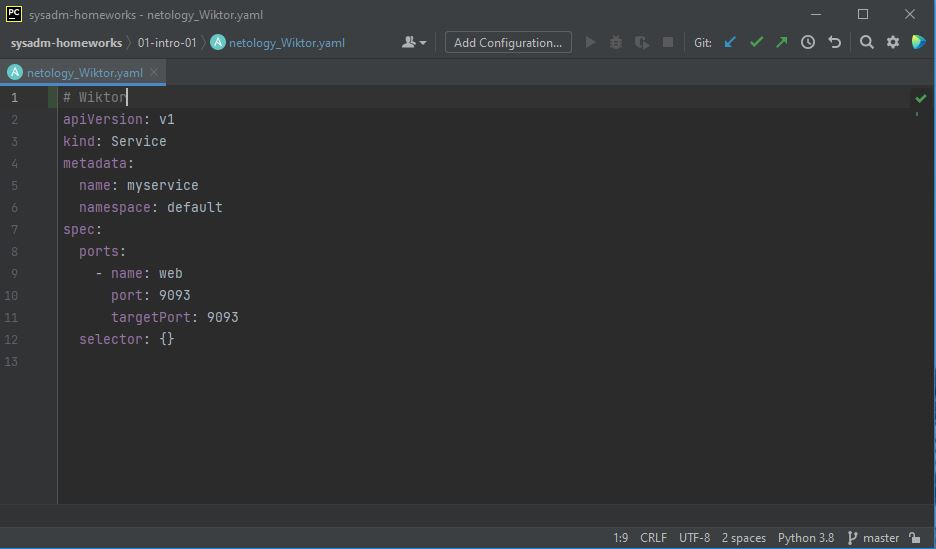

# Домашнее задание к занятию «1.1. Введение в DevOps»

## Задание №1 - Подготовка рабочей среды

- Terraform: 

- Bash: 

- Markdown: 

- Yaml: 

- Jsonnet: 

## Задание №2 - Описание жизненного цикла задачи (разработки нового функционала)

### Решение задачи

- Менеджер принимает заявку
- Менеджер обрабатывает заявку и выдет задание разработчикам
- Разработчики разбивают задание на задачи
- Задачи перинимаются к исполнению 
- Выполненые задачи проходят тестирование
- Задачи не прошедшие тестирование возвращаются на доработку
- Задачи прошедшие тестирование переходят на одобрение к менеджеру 
- Неодобренные задачи возвращаются на доработку 
- Одобренные задачи выходят в релиз

DevOps инженер обеспечивает:
- оценку и оптимизацию процесса развертывания ПО;
- синхронизацию и автоматизацию всех процессов, связанных с развертыванием приложения;
- создание оптимальных условий для функционирования ПО;
- подготовку операционной среды для внесения изменений;
- поддержку и стандартизацию тестового окружения;
- создание инструментов для мониторинга запущенных приложений;
- контроль производительности приложений;
- реагирование на обнаруженные проблемы и внештатные ситуации в ходе развертывания ПО.